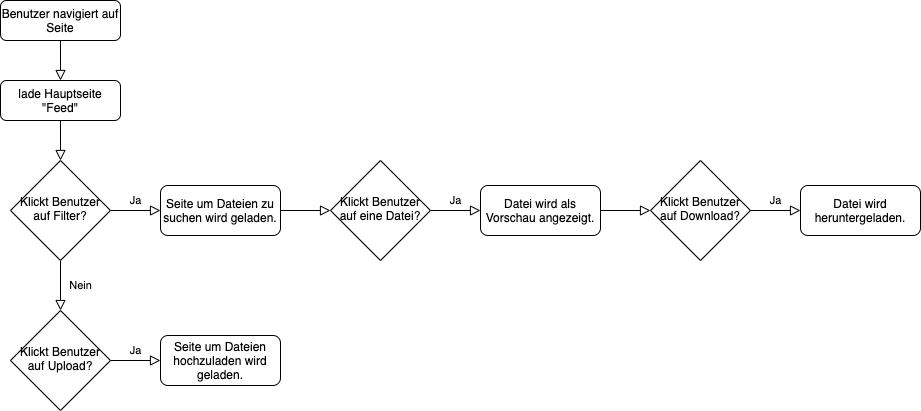

# PROG2 WebApp

## Fragen
- Welches Format soll benutzt werden für die Eingabe, Speicherung und Ausgabe?

## TODO
- [x] Create project proposal
- [x] erste Besprechung mit Dozenten
- [x] Ablaufdiagramm erstellen
- [ ] Mockups erstellen
- [ ] Basic Layout (Dashboard) mit HTML, CSS und Bootstrap (?)
- [ ] Implementierung Upload
  - [ ] weitere Seite erstellen für den Upload
  - [ ] Eingabemasken definieren und erstellen
  - [ ] Speicherung ermöglichen
- [ ] Implementierung Download
  - [ ] Eingabemasken definieren
- [ ] Implementierung Like Button
  - [ ] counter implementieren

## Ausgangslage / Motivation
Es soll eine Dateiaustauschplattform entstehen, auf welcher Nutzer verschiedene Dateien (Bilder, Videos, Projektideen, Mockups, Zusammenfassungen oder ähnliches) hoch- und runterladen können. Zudem können Nutzer die Qualität der Dateien bewerten.

## Funktion/Projektidee
- Dateien hochladen
- nach Dateien suchen und filtern
– Dateien anschauen
- Dateien bewerten
- Dateien herunterladen

## Workflow
- User kann Datei hochladen und einen Namen geben.
- User kann in Dashboard verschiedene Dateien der Community anschauen, liken, filtern und runterladen.
- User kann Dateien jederzeit löschen.

### Dateneingabe
Eine Datei hat folgende Informationen, die vom Benutzer angegeben werden müssen:
- Dateiname
- Ersteller

### Datenverarbeitung/Speicherung
Als Datenspeicherung wird eine JSON Datei verwendet.
...

### Datenausgabe
Download via ???

## Seitennavigation / Szenarios
\

FRAN 1.3.2020
