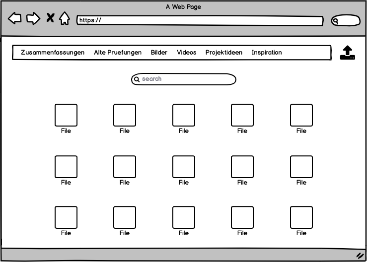

# PROG2 WebApp

## Ausgangslage / Motivation
Es soll eine Dateiaustauschplattform entstehen, auf welcher Nutzer verschiedene Dateien (Bilder, Projektideen, Mockups, Zusammenfassungen oder ähnliches) hoch- und runterladen können.
Weiter soll mithilfe von Plotly eine Grafik mit den gesammelten Daten erstellt werden.

## Funktion/Projektidee
- Dateien hochladen
– Dateien anschauen
- Dateien herunterladen
- Daten visualisieren

## Workflow
- User kann Datei hochladen und einen Namen sowie eine Beschreibung geben.
- User kann in Dashboard verschiedene Dateien der Community anschauen und runterladen
- auf einer separaten Seite kann ein User die Anzahl verschiedener Formate auf der WebApp anzeigen lassen.

### Dateneingabe
Eine Datei hat folgende Informationen, die vom Benutzer angegeben werden müssen:
- Titel
- Autorname
- Dateiname
- Beschreibung
- "Select Image"-Option

### Datenverarbeitung/Speicherung
Als Datenspeicherung wird eine JSON Datei verwendet.
Plotly wird für die Visualisierung einer Grafik benutzt.
...

### Datenausgabe
Download der verschiedenen Dateien mithilfe von Jinja.

## Mockups
### Startseite / Dashboard / Feed

### Upload

### Filterfunktion

### Download

## Seitennavigation / Szenarios
